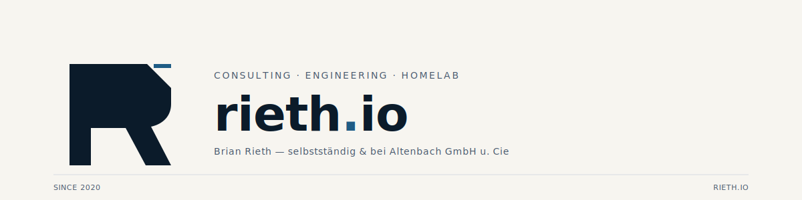

<p align="center">
  
</p>

<p align="center">
  <sub><code>DEVOPS</code> · <code>KUBERNETES</code> · <code>HOMELAB</code> · <code>BAU-IT</code> · <code>KI</code> · <code>SECURITY</code></sub>
</p>

<p align="center">
  <a href="https://rieth.io">rieth.io</a> ·
  <a href="https://erp.rieth.io">erp.rieth.io</a> ·
  <a href="https://onedev.rieth.io">onedev.rieth.io</a>
</p>

---

<sub><code>§ 01 — ÜBER MICH</code></sub>

### Profil

IT-Infrastruktur, die funktioniert. Pragmatische Lösungen für Server,
Netzwerke und Automatisierung — von der Planung bis zum laufenden Betrieb.

Solo-IT aus dem Rhein-Neckar-Raum, hauptberuflich als Principal-IT bei der
**Bauunternehmung A. Altenbach GmbH u. Cie**.

```
34+ Server & Container   ·   99.9% Uptime SLA   ·   24/7 Monitoring
6+ Jahre Erfahrung       ·   < 5 min Incident Response
```

---

<sub><code>§ 02 — SERVICES</code></sub>

### Leistungen

| Bereich                           | Stack & Tools                                                           |
|:----------------------------------|:------------------------------------------------------------------------|
| `devops` & Automatisierung        | Git-Pipelines, Kubernetes, IaC, Ansible, Shell, Cron                    |
| `kubernetes` & Container-Platform | k3s, Flux GitOps, Docker, LXC, Image-Registry, NodePort/Ingress         |
| `server` & Virtualisierung        | Proxmox VE, LXC, KVM, GPU-Passthrough, PBS, Synology NFS                |
| `network` & Security              | VLAN-Segmentierung, OPNsense / UniFi UDM, WireGuard, TLS, Zero-Trust    |
| `observability`                   | Checkmk, Wazuh SIEM, CrowdSec, Grafana, zentrale Log-Aggregation        |
| `fullstack` & KI                  | Next.js, React, FastAPI, Claude API, Ollama lokal, Qdrant, Playwright   |
| `consulting`                      | Architektur-Reviews, Migrationen, herstellerunabhängige Beratung        |

---

<sub><code>§ 03 — STACK</code></sub>

### Tech

```
frontend     Next.js 16 · TypeScript · Tailwind · shadcn/ui · Astro · Vite
backend      FastAPI · SQLAlchemy · Prisma · PostgreSQL 16-18 · Alembic
runtime      k3s (Kubernetes) · Docker · LXC · Flux CD · OneDev CI
infra        Proxmox VE · OPNsense · UniFi · Synology · WireGuard
observe      Checkmk 2.4 · Wazuh · CrowdSec · Grafana · Loki
ai / ml      Anthropic Claude · Ollama (qwen2.5, llama) · Qdrant · RAG · LangChain
tooling      OneDev · Paperless-ngx · Zammad · Matrix · Home Assistant
```

---

<sub><code>§ 04 — PROJEKTE</code></sub>

### Aktuelle Arbeit

| Projekt                    | Beschreibung                                                                  | Stack                                                       |
|:---------------------------|:------------------------------------------------------------------------------|:------------------------------------------------------------|
| `erp.rieth.io`             | Custom Business Cockpit — Aufträge, Rechnungen, Kunden, Zeit                  | Next.js · FastAPI · PostgreSQL · k3s                        |
| `Altenbach-App`            | Mobile Companion zu iTWO 4.0 — Fahrtenbuch, ERP-Sync, SSO                     | Next.js · Prisma · NextAuth (Entra ID) · k3s 2-Replica      |
| `BaSec`                    | Freelancermap-Scraping, semantisches Matching, automatisierte CV/Bewerbung    | FastAPI · React · Playwright · Claude API · WeasyPrint      |
| `DORA.KI`                  | Compliance-Audits gegen DORA / ISO 27001 / BSI-Grundschutz, vollständig lokal | Python · Ollama · Qdrant · SentenceTransformers             |
| `WeismehlMedia-App`        | ERP & Projektmanagement, JWT-Auth, Rollen, PDF-Renderer                       | FastAPI · React · SQLAlchemy · Flux Image-Policy · k3s      |
| `SOAR`                     | Security-Orchestrator — Alerts → KI-Klassifizierung → Quarantäne-VLAN         | FastAPI · Redis · Ollama · Matrix-Bot                       |
| `Paperless-AI`             | Dokumenten-Tagging, Steuerabzugs-Erkennung, Rechnungs-Extraktion              | FastAPI (RAG) · Node.js · SQLite                            |
| `Clawdbot`                 | KI-Chatbot über WhatsApp, Telegram, Discord, Slack, Matrix, iMessage          | Node.js 22 · Claude / GPT                                   |
| `superset-fork` · `t8code` | Agent-Orchestrierung — parallele Claude / Codex-Instanzen via Worktrees       | Electron · Claude SDK · TypeScript Monorepo                 |
| `rieth.io`                 | Portfolio-Site mit 1999-Geocities-Easter-Egg, Kontakt → Zammad                | Astro 6 · TailwindCSS 4 · Cloudflare Turnstile              |

---

<sub><code>§ 05 — INFRASTRUKTUR</code></sub>

### Homelab & Kubernetes-Cluster

```
hardware     AM5-Host  ·  Ryzen 9950X  ·  64 GB DDR5  ·  10 G Uplinks
nodes        24 LXC  ·  diverse VMs  ·  k3s Single-Node auf VM501
network      11 UniFi-Geräte  ·  7 VLANs  ·  UDM Pro  ·  Unbound + Blocklists
backup       PBS auf Synology NFS  ·  täglich, off-site verifiziert
ci / cd      OneDev → Docker-Build → k3s-Deployment via Flux GitOps
data         PostgreSQL 18 zentral · Matrix-Server · Paperless-ngx · Jellyfin
security     Wazuh SIEM · CrowdSec · WireGuard VPN · Quarantäne-VLAN für IoT
```

Produktiv betriebener k3s-Cluster — keine Hobby-Spielwiese, sondern
Plattform für eigene SaaS-Apps und Kunden-Workloads.

---

<sub><code>§ 06 — REFERENZEN</code></sub>

### Kunden

| Kunde                        | Bereich                                          |
|:-----------------------------|:-------------------------------------------------|
| Altenbach GmbH u. Cie        | iTWO-Integration, Infrastruktur, Security        |
| Edeka Markt 042751           | IT-Betreuung                                     |
| BaSec                        | Freelancer-Plattform, Recruiting-Automation      |
| Goldschmiede MB              | IT-Beratung                                      |
| WeismehlMedia                | ERP / CRM / Projektmanagement                    |

---

<sub><code>§ 07 — KONTAKT</code></sub>

### Erreichbar

| Kanal     | Adresse                                              |
|:----------|:-----------------------------------------------------|
| Standort  | Heidelberg / Rhein-Neckar                            |
| Mail      | über [rieth.io / #kontakt](https://rieth.io#kontakt) |
| Web       | [rieth.io](https://rieth.io)                         |
| Git       | [onedev.rieth.io](https://onedev.rieth.io)           |

---

<sub align="center"><code>© rieth.io · 0B1B2A / 1F5C85 · Inter + JetBrains Mono · seit 2020</code></sub>
